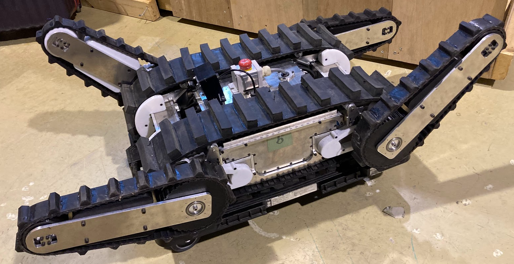

# OSP
長岡技術科学大学木村研究室が開発・提供しているレスキュー対応ロボットのためのプラットフォームロボットOSPのROS2パッケージ


ハードウェアのリポジトリはこちらから↓<br>
[opensource-platform](https://github.com/yanagi-kimuralab/opensource-platform?tab=readme-ov-file)

# 環境構築
## 要件
[![humble][humble-badge]][humble]
[![ubuntu22][ubuntu22-badge]][ubuntu22]
- Ubuntu22.04
- ROS2 Humble

## 依存関係
```bash
source /opt/ros/humble/setup.bash

git clone https://github.com/Nexis-R/osp
cd osp
# 自動インストールスクリプト
sudo ./scripts/install-all
# Desktopアプリの追加スクリプト
./scripts/install-auto-bringup-scripts
vcs import --input depends.rosinstall --recursive src
rosdep update
rosdep install -r -y -i --from-paths .
```

## ビルド
```bash
cd ~/osp
colcon build --symlink-install
source install/setup.bash
```

## 使用方法

### オペレーターPC
```bash
ros2 launch osp_teleop osp_teleop.launch.xml
```

### ロボット側NUC PC
```bash
ros2 launch osp_bringup osp_bringup.launch.xml
```

## 番外編 (.desktopのユーザー名変更)
## .desktopのユーザー名変更
Desktopにある自動起動では"~"が使えない為、home/usrnameのように直接usernameを入力する必要がある。
"home/username/Desktop/OspRobotAuto.desktop"と"home/username/Desktop/OspTeleopAuto.desktop"のusernameを正しい名前に変更する。(todo:この作業をしなくてもいいように調整する)

### OspRobotAuto.desktop
```.desktop
[Desktop Entry]
Version=1.0
Type=Application
Name=Start Osp Robot
# you should change usr_name (ex:osp-nuc)
Exec=/home/usr_name/osp/scripts/setup_data/osp_robot_auto_start.sh
Icon=/home/usr_name/osp/scripts/setup_data/icons/robot.png
Terminal=true
Categories=Utility;
```

### OspTeleopAuto.desktop
```.desktop
[Desktop Entry]
Version=1.0
Type=Application
Name=Start Osp Teleop
# you should change usr_name (ex:osp-nuc)
Exec=/home/usr_name/osp/scripts/setup_data/osp_teleop_auto_start.sh
Icon=/home/usr_name/osp/scripts/setup_data/icons/teleop.png
Terminal=true
Categories=Utility;
```